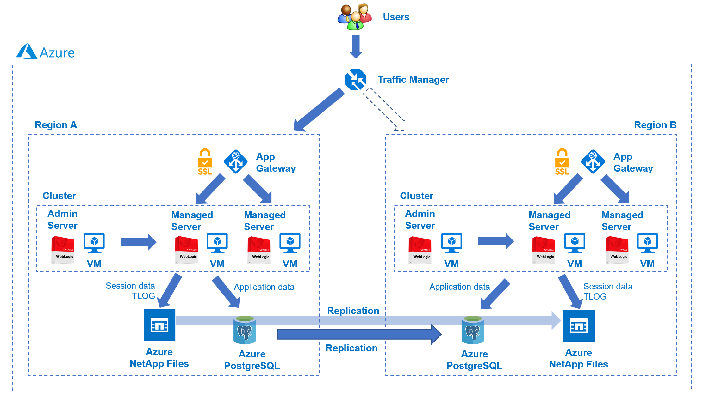
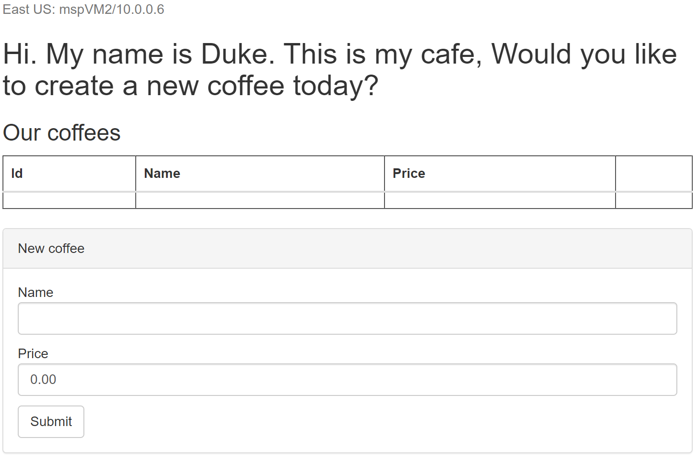
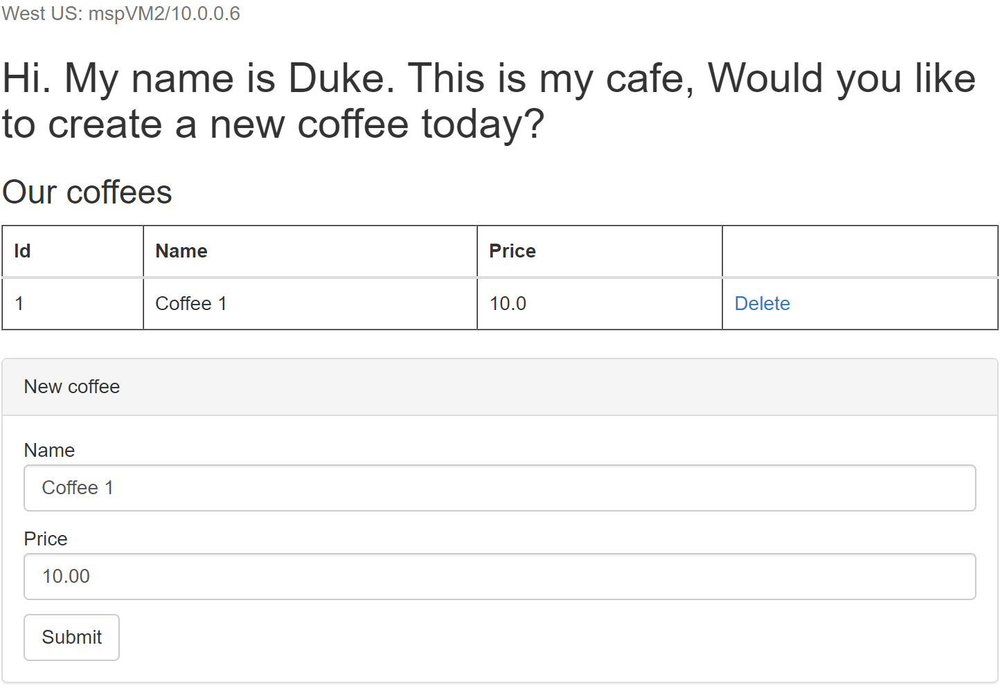

# Deploying a disaster recovery solution of WebLogic on Azure VMs

This guide instructus how you can create an environment to demonstrate the disaster recovery solution of WebLogic on Azure VMs:



The solution uses the [WebLogic file-based store](https://docs.oracle.com/en/middleware/standalone/weblogic-server/14.1.1.0/store/overview.html#GUID-EF63DF13-EA0A-4D65-9883-B03381A79F0B) to persist server data (session data, TLOG, etc.), and [JDBC Data Source](https://docs.oracle.com/en/middleware/standalone/weblogic-server/14.1.1.0/jdbca/jdbc_datasources.html#GUID-4C417DE8-866E-4A31-BCAB-CDF8EC5AFF4F) to persist application data. As these data will be asychronouslly repliated to the secondary Azure NetApp Files volume and Azure PostgreSQL server replica connected by a passive cluster in a different region, they can be retrieved back once the passive cluster is promoted to a primary one in a disaster recovery event. 

## Prerequisites

Make sure the following prerequisites are satisfied before you move on to next steps.

1. You will need an Azure subscription. If you don't have one, you can get one for free for one year [here](https://azure.microsoft.com/free).
1. Install a Java SE implementation (for example, [AdoptOpenJDK OpenJDK 8 LTS/OpenJ9](https://adoptopenjdk.net/?variant=openjdk8&jvmVariant=openj9)).
1. Install [Maven](https://maven.apache.org/download.cgi) 3.5.0 or higher.
1. Download this repository somewhere in your file system (easiest way might be to download as a zip and extract).
1. Register **Unix permissions** feature and **change ownership mode** feature for NFS volume of Azure NetApp Files:
   
   ```
   az feature register --namespace Microsoft.NetApp --name ANFUnixPermissions
   az feature register --namespace Microsoft.NetApp --name ANFChownMode
   ```
   
   Note: 
   * You can check the feature registration state using the following commands:

     ```
     az feature show --namespace Microsoft.NetApp --name ANFUnixPermissions
     az feature show --namespace Microsoft.NetApp --name ANFChownMode
     ```
   
   * The registration state may be in the `Registering` state for up to 60 minutes before changing to `Registered`. You can proceed the guide until section [Setting up cross-region replication of Azure NetApp Files volumes](#setting-up-cross-region-replication-of-azure-netapp-files-volumes), then you have to wait until the state is `Registered` before continuing. Details pls reference [this doc](https://docs.microsoft.com/azure/azure-netapp-files/configure-unix-permissions-change-ownership-mode).

## Setting up Managed PostgreSQL databases on Azure

You will be using the fully managed PostgreSQL offering in Azure to persist application data for this demo. Below is how you set it up.

### Setting up the primary replica of database server

The primary replica will be located in East US region, and connected to the active WebLogic cluster which will be also deployed in East US region later.

1. Go to the [Azure portal](http://portal.azure.com).
1. Select 'Create a resource'. In the search box, enter and select 'Azure Database for PostgreSQL'. Hit Create. Select a single server.
  1. The steps in this section use `<your prefix>`. The prefix could be your first name.  It's suggested to be short, reasonably unique, and less than 10 characters in length.
1. Create and specify a new resource group named `<your prefix>`-demo-postgres. 
1. Specify and log down the Server name to be `<your prefix>`-demo-eastus.
1. Specify the location to be **East US**.
1. Leave the Version at its default.
1. Specify and log down the Admin username to be `demouser`. 
1. Specify and log down the Password to be `<your unique password>`. 
1. Hit 'Review+create' then 'Create'. Wait until the deployment completes.
1. Click "Go to resource".
1. Under Settings, open the "Connection security" panel.
   1. Toggle "Allow access to Azure services" to "Yes".
   1. Toggle "Enforce SSL connection" to "DISABLED". 
   1. Hit Save. Wait until it completes.

### Setting up the secondary replica of the data store

The sencondary replica will be located in West US region, and connected to the passive WebLogic cluster which will be also deployed in West US region later.

1. Under Settings of the PostgreSQL server (`<your prefix>`-demo-eastus) you created in the previous step, open the "Replication" panel.
   1. Click "Add Replica" 
   1. Specify and log down the Server name to be `<your prefix>`-demo-westus.
   1. Specify the location to be **West US**.
   1. Hit OK. Wait until the deployment completes.
1. Once it completes, click "Go to resource" and toggle "Allow access to Azure services" to "Yes" in "Settings > Connection security" panel for the PostgreSQL server (`<your prefix>`-demo-westus), then Save. Wait until it completes.

## Setting up WebLogic clusters on Azure

The next is to set up two WebLogic clusters in East US and West US regions. The active cluster in East US is running and handing the requests routed by the Traffic Manager, and the passive cluster in West US is stopped which means it's not handing the request in the normal situation but will be booted and promoted to primary cluster if failover occurs due to the outage of the active cluster.

### Deploy the active WebLogic cluster

Follow the steps below to set up the 1st WebLogic cluser in East US region which acts as an active cluster.

1. Go to the [Azure portal](https://ms.portal.azure.com/).
1. Use the search bar on the top to navigate to the Marketplace.
1. In the Marketplace, type in "Oracle WebLogic Server Cluster" in the search bar and click Enter.
1. Locate the offer named "Oracle WebLogic Server Cluster" and click.
1. Click Create.
1. In the "Basics" page:
   1. Create and specify a new resource group named `<your prefix>`-demo-wls-cluster-eastus.
   1. Select the Region to be **East US**.
   1. Specify and confirm "Password" for admin account of VMs. Log down the user name and password in case you want to sign into the operating system of WebLogic server VM after the deployment.
   1. Specify and confirm "Password for WebLogic Administrator". Log down the user name and password as the credential will be used for signing into WebLogic Admin console later.
   1. Speicify 3 for "Number of VMs", which means the cluster consists of 1 admin node and 2 managed nodes.
   1. Click Next.
1. In the "TLS/SSL Configuration" page, click Next.
1. In the "Azure Application Gateway" page:
   1. Select "Yes" for "Connect to Azure Application Gateway".
   1. Select "Generate a self-signed certificate" for "Select desired TLS/SSL certificate option"
   1. Add a user-assigned managed identity for "User assigned managed identity". If you don't have a user-assigned managed identity, open Azure portal in a new tab and [create one](https://docs.microsoft.com/azure/active-directory/managed-identities-azure-resources/how-manage-user-assigned-managed-identities?pivots=identity-mi-methods-azp#create-a-user-assigned-managed-identity), then return here to continue.
   1. Click Next.
1. In the "DNS Configuration" page, click Next.
1. In the "Database" page:
   1. Select "Yes" for "Connect to database?".
   1. Select "Azure database for PostgreSQL" for "Choose database type".
   1. Specify `jdbc/WebLogicCafeDB` for "JNDI Name". Note: this value determines the data source name used in the sample application.
   1. Specify `jdbc:postgresql://<your prefix>-demo-eastus.postgres.database.azure.com:5432/postgres` for "DataSource Connection String".
   1. Select `None` for "Global transactions protocol".
   1. Specify `demouser@<your prefix>-demo-eastus` for "Database username".
   1. Specify and confirm `<your unique password>` that you logged down before for "Database Password".
   1. Click "Review + create".
1. In the "Review + create" page:
   1. You must see "Validation passed". Otherwise you must troubleshoot and resolve the reason why before continuing.
   1. Click Create.
1. It will take some time for the WebLogic cluster to properly deploy. Wait until it completes.
1. In the deployment page:
   1. Click "Outputs".
   1. Copy value of property "appGatewayURL" > Open it in a new browser tab > You should see "Error 404--Not Found". If not, you must troubleshoot and resolve the reason why before continuing.
   1. Copy and log down value of property "adminConsole" > Open it in a new browser tab > You should see login page of "WebLogic Server Administratiion Console" > Sign into the console with the user name and password for WebLogic administrator. If you are not able to sign, you must troubleshoot and resolve the reason why before continuing.
1. Click "Overview" to switch back Overview page of the deployment. Click "Go to resource group".
   1. Find resource "wls-nsg" with type "Network security group" > Click to open > Click "WebLogicPorts" from "Inbound Security Rules" list > Append `,22` to "Destination port ranges" > Click "Save". Wait until the saving completes.
   1. Find resource "gwip" with type "Public IP address" > Click to open > Copy and log down value of "IP address".
   1. Find resource "mspVM1" with type "Virtual machine" > Click to open > Copy and log down value of "Public IP address".
   1. Find resource "mspVM2" with type "Virtual machine" > Click to open > Copy and log down value of "Public IP address".

### Deploy the passive WebLogic cluster

Follow the same steps in section [Deploy the active WebLogic cluster](#deploy-the-active-weblogic-cluster) to deploy the 2nd WebLogic cluser in West US region which acts as a passive cluster, except the following differences/highlights:

1. In the "Basics" page:
   1. Create and specify a new resource group named `<your prefix>`-demo-wls-cluster-westus.
   1. Select the Region to be **West US**.
1. In the "Database" page:
   1. Specify `jdbc:postgresql://<your prefix>-demo-westus.postgres.database.azure.com:5432/postgres` for "DataSource Connection String".
   1. Specify `demouser@<your prefix>-demo-westus` for "Database username".

## Setting up cross-region replication of Azure NetApp Files volumes 

As described in [Prerequisites](#prerequisites), please check and wait until registration state of feature `ANFUnixPermissions` and `ANFChownMode` is changed to be `Registered` before continuing. 

```
az feature show --namespace Microsoft.NetApp --name ANFUnixPermissions
az feature show --namespace Microsoft.NetApp --name ANFChownMode
```

Next, pls invoke the following commands to get the change propagated:

```
az provider register -n Microsoft.NetApp
```

Now you will be using cross-region replication of Azure NetApp Files volumes to persist session data and JTA Transaction Log (TLOG) for this demo. Below is how you set it up.

### Setting up the primary volume for persisting active cluster state

The primary volume will be located in East US region, and connected to the active WebLogic cluster later.

1. Go to the [Azure portal](http://portal.azure.com).
1. Select 'Create a resource'. In the search box, enter and select 'Azure NetApp Files'. Hit Create.
1. Specify "Name" to be `<your prefix>`-demo-naf-eastus.
1. Select same subscrition used for creating other Azure resources in this guide.
1. Select `<your prefix>`-demo-wls-cluster-eastus for "Resource group".
1. Specify the location to be **East US**.
1. Hit 'Create'. Wait until the deployment completes.
1. Click "Go to resource".
1. Under "Storage service", open the "Capacity pools" panel.
   1. Click "+ Add pool".
   1. Specify "Name" to be `capacity-pool-eastus`.
   1. Hit "Creaet". Wait until the creation completes.
   1. Click `capacity-pool-eastus` from the list of capacity pools.
   1. Under "Storage service", open the "Volumes" panel.
      1. Click "+ Add volume".
      1. Specify "Volume name" to be `volume-eastus`.
      1. Verify the default selected virtual network is the one from resource group `<your prefix>`-demo-wls-cluster-eastus.
      1. Click "Create new subnet". Specify "Delegated subnet name" to be `subnet-eastus`. Click OK.
      1. Click Next.
      1. Verify the default selected protocol type is "NFS".
      1. Select "Versions" to be `NFSv4.1`.
      1. Specify "Unix Permissions" to be `0777`.
      1. Click "Review + create".
      1. Click "Create". Wait until the deployment completes.
      1. Click "Go to resource".
      1. Under "Settings", open the "Properties" panel.
      1. Copy and log down the value of "Resource ID".

### Setting up the secondary replication volume for passive cluster

The sencondary replication will be located in West US region, and connected to the passive WebLogic later.

1. Go to the [Azure portal](http://portal.azure.com).
1. Select 'Create a resource'. In the search box, enter and select 'Azure NetApp Files'. Hit Create.
1. Specify "Name" to be `<your prefix>`-demo-naf-westus.
1. Select same subscrition used for creating other Azure resources in this guide.
1. Select `<your prefix>`-demo-wls-cluster-westus for "Resource group".
1. Specify the location to be **West US**.
1. Hit 'Create'. Wait until the deployment completes.
1. Click "Go to resource".
1. Under "Storage service", open the "Capacity pools" panel.
   1. Click "+ Add pool".
   1. Specify "Name" to be `capacity-pool-westus`.
   1. Hit "Creaet". Wait until the creation completes.
   1. Click `capacity-pool-westus` from the list of capacity pools.
   1. Under "Storage service", open the "Volumes" panel.
      1. Click "+ Add data replication".
      1. Specify "Volume name" to be `volume-westus`.
      1. Verify the default selected virtual network is the one from resource group `<your prefix>`-demo-wls-cluster-westus.
      1. Click "Create new subnet". Specify "Delegated subnet name" to be `subnet-westus`. Click OK.
      1. Click Next.
      1. Verify the default selected protocol type is "NFS".
      1. Select "Versions" to be `NFSv4.1`.
      1. Click "Next".
      1. Speicify "Source volume ID" to be the copied value of "Resource ID" in [previous section](#setting-up-the-primary-volume-for-persisting-active-cluster-state).
      1. Select "Replication schedule" to be "Every 10 minutes".
      1. Click "Review + create".
      1. Click "Create". Wait until the deployment completes.
      1. Click "Go to resource".
      1. Under "Settings", open the "Properties" panel.
      1. Copy and log down the value of "Resource ID".

### Authorize volume replication

To successfully replicate data from the primary volume to the secondary volume, you need to grant the authorization of replication to the primary volume. 

1. In the portal, go to 'All resources'. Enter `<your prefix>`-demo-naf-eastus into the filter box and press Enter.
1. You should see one resource with name prefix "volume-eastus" and type "Volume". Click it to open.
1. Under "Storage service", open the "Replication" panel.
1. Click "Authorize".
1. Specify "Destination volume id" to be the copied value of "Resource ID" in [previous section](#setting-up-the-secondary-replication-volume-for-passive-cluster).
1. Click OK. Wait until the authorization completes.
1. Refresh the page, you should see "End point type" is `Source`, "Destination" is `volume-westus`.

### Mount volume to managed server VMs in the cluster

The last step is to mount volume to the managed server VMs in the cluster so the server state can be persisted to the volume and replicated to the secondary one.

First, let's mount primary volume to managed sever VMs in the primary cluster.

1. In the portal, go to 'All resources'. Enter `<your prefix>`-demo-naf-eastus into the filter box and press Enter.
1. You should see one resource with name prefix "volume-eastus" and type "Volume". Click it to open.
1. Under "Storage service", open the "Mount instructions" panel.
1. Copy and log down the value of "Mount your file system using the command/s below". It should look like `sudo mount -t nfs -o rw,hard,rsize=65536,wsize=65536,sec=sys,vers=4.1,tcp <private-ip-address>:/<file-path> <mount-point>`. Update it to be `sudo mount -t nfs -o rw,hard,rsize=65536,wsize=65536,sec=sys,vers=4.1,tcp <private-ip-address>:/<file-path> /u01/oracle/share` by replacing the `<mount-point>` with `/u01/oracle/share`.
1. Open a terminal that supports `ssh` command.
1. For VMs `mspVM1` and `mspVM2` located in resource group `<your prefix>`-demo-wls-cluster-eastus, do the followings for each of them:
   1. ssh to the VM with its public IP address and credentials of WebLogic Administrator you copied before: 
      ```
      ssh <admin_username>@<public_ip_address>
      ```
   1. Change to root privilidge using the password of WebLogic Administrator:
      ```
      sudo -i
      ```
   1. Replace `<private-ip-address>:/<file-path>` with the appropriate one and run the following commands:
      ```
      yum install -y nfs-utils
      mkdir /u01/oracle/share
      mount -t nfs -o rw,hard,rsize=65536,wsize=65536,sec=sys,vers=4.1,tcp <private-ip-address>:/<file-path> /u01/oracle/share
      bash -c "echo \"<private-ip-address>:/<file-path> /u01/oracle/share nfs bg,rw,hard,noatime,nolock,rsize=65536,wsize=65536,sec=sys,vers=4.1,tcp,_netdev 0 0\" >> /etc/fstab"
      ```

      Note: If you observe the following error message `mount.nfs: mounting <private-ip-address>:/<file-path> failed, reason given by server: No such file or directory`, please wait for a while and re-run the command below until it succeeds:
      ```
      mount -t nfs -o rw,hard,rsize=65536,wsize=65536,sec=sys,vers=4.1,tcp <private-ip-address>:/<file-path> /u01/oracle/share
      ```
      The root cause is unknown yet, but the possible reason is that the mirroring of two volumes is being initialized.

   1. Run `df -h` to verify the mount. You should see the output includes the following similar entry if everything goes well:
      ```
      <private-ip-address>:/<file-path>                      100G  832K  100G   1% /u01/oracle/share
      ```
      If you don't see this, you must troubleshoot and resolve the reason why before continuing.

Similarily, mount replicated volume `volume-westus` in resource group `<your prefix>`-demo-naf-westus to managed sever VMs in the passive cluster located in resource group `<your prefix>`-demo-wls-cluster-westus, by following the steps above.

## Setting up Azure Traffic Manager

You will be using the Azure Traffic Manager to route the user requests to the active WebLogic cluster deployed on East US region or the passive cluster deployed on West US region.

1. Go to the [Azure portal](http://portal.azure.com).
1. Select 'Create a resource'. In the search box, enter and select 'Traffic Manager profile'. Hit Create.
1. Specify `<your prefix>`-demo for "Name".
1. Select "Priority" for "Routing method".
1. Select appropirate subscription.
1. Create and specify a new resource group named `<your prefix>`-demo-traffic-manager. 
1. Hit 'Create'. Wait until the deployment completes. Click "Go to resource".
1. Under Settings, open the "Configuration" panel. You're going to configure probing settings.
   1. Set `200-404` for "Expected Status Code Ranges".
   1. Select `10` for "Probing internal".
   1. Set `1` for "Tolerated number of failures".
   1. Set `5` for "Probe timeout".
   1. Hit Save. Wait until it completes.
1. Under Settings, open the "Endpoints" panel. You're going to add two Azure endopoints.
   1. Click "+Add".
   1. Select "Azure endpoint" for "Type".
   1. Specify "gw-eastus" for "Name".
   1. Select "Public IP address" for "Target resource type".
   1. Find out the copied public IP address of `gwip` in section [Deploy the active WebLogic cluster](#deploy-the-active-weblogic-cluster), then select the matched item from the list for "Public IP address".
   1. Hit Add. Wait until it completes.
   1. Click "+Add" again to add another Azure endpoint using the copied value of public IP address deployed in the **West US** region by following the same steps above, but set "gw-westus" for "Name" and select right item for "Public IP address". Make sure the value of Priority is 2.
   1. Wait until the value of "Monitoring status" for both endpoints are changed from "Checking endpoint" to "Online". You can manually click Refresh to update the status.
1. Switch back to "Overview" panel, find and copy the value for "DNS name", open a new tab of the browser, paste the copied value into the address bar, and hit `Enter` key. You should see "Error 404--Not Found". If not, you must troubleshoot and resolve the reason why before continuing. 

## Configuring WebLogic clusters

The next is to configure two WebLogic clusters for disaster recovery. It includes deployment of a sample app, updating Frontend Host of the cluster, and confiugration of default file store.

### Sign in to WebLogic Server Administratiion Console

Find out the copied value of "adminConsole" and credentials of "WebLogic Administrator" in section [Deploy the active WebLogic cluster](#deploy-the-active-weblogic-cluster), open it in a new browser tab, and sign in.

Similarly, sign in to WebLogic Server Administratiion Console using the the copied value of "adminConsole" and credentials of "WebLogic Administrator" in section [Deploy the passive WebLogic cluster](#deploy-the-passive-weblogic-cluster).

### Deploy sample app

Next, build and package a sample CRUD JavaEE application that can be used for demonstrating if the solution of disaster recovery works later.

1. Checkout this repository.
1. Locate the path where the repository was downloaded.
1. Change to its sub-dirctory `dr-filesystem/weblogic-cafe`.
1. Compile and package the sample application: `mvn -Dregion="East US" clean package`.
1. The package should be successfully generated and located at `<your local clone of the repo>/dr-filesystem/weblogic-cafe/target/weblogic-cafe.war`. If you don't see this, you must troubleshoot and resolve the reason why before continuing.

Now you can deploy it to the WebLogic cluster.

1. Make sure you have signed in to WebLogic Server Administratiion Console for the active cluster.
1. Locate to "Domain structure > wlsd > Deployments" in the left navigation area. Click "Deployments".
1. Click Lock & Edit > Install > Upload your file(s) > Choose File >  Select "weblogic-cafe.war" you prepared above > Next > Next > Next > Select "cluster1" with option "All servers in the cluster" as deployment target. Click Next > Finish > Activate Changes.
1. Switch to Control > Select "weblogic-cafe" > Click "Start" with option "Servicing all requests" > Wait for a while and refresh the page, until you see the state is Active > Switch to Monitoring > Copy value of Context Root. It should be "/weblogic-cafe".

Similarly, follow the same steps above in WebLogic Server Administratiion Console for the passive cluster, except:

1. Compile and package the sample application: `mvn -Dregion="West US" clean package`.
1. After you clicked "Activate Changes", you may see the following error messages:
   ```
   Error An error occurred during activation of changes, please see the log for details.
   Error java.lang.RuntimeException: Cannot make directory: /u01/oracle/share/wls-sessions/weblogic-cafe.war
   Error Cannot make directory: /u01/oracle/share/wls-sessions/weblogic-cafe.war
   ``` 
   This is because the replication volume is read-only and the same path created in the primary volume hasn't been synchronized to the replication volume yet. You need to wait for the synchronization completes, delete the app deployment and re-install the sample app until it succeeds.

### Change Frontend Host to DNS name of traffic manager

Since the Azure Traffic Manager is sitting at the front of two WebLogic clusters to routing user requests, the Front Host of the WebLogic cluster needs to be updated to the DNS name of Traffic Manager.

1. Make sure you have signed in to WebLogic Server Administratiion Console for the active cluster.
1. Locate to "Domain structure > wlsd > Environment > Clusters" in the left navigation area. Click "Clusters".
1. You should see "cluster1" listed in the right work area. Click "cluster1".
1. Click HTTP > Lock & Edit > Find out the copied "DNS name", remove the starting "http://" and set the remaining for "Frontend Host" > Save > Activate Changes.

Similarly, follow the same steps above in WebLogic Server Administratiion Console for the passive cluster.

### Configure default file store

Next, you're going to configure default file store where TLOG is persisted for all managed servers of the two clusters.

1. Make sure you have signed in to WebLogic Server Administratiion Console for the active cluster.
1. Locate to "Domain structure > wlsd > Environment > Servers" in the left navigation area. Click "Servers".
1. You should see server `msp1` and `msp2` listed in the right work area. 
1. Click `msp1` > Services > Lock & Edit > Under "Default Store", set "Directory" to be `/u01/oracle/share/store` > Save > Activate Changes.
1. Click Servers > `msp2`, and execute the same steps as described above.

Similarly, follow the same steps above in WebLogic Server Administratiion Console for the passive cluster.

### Restart managed servers for the active cluster

For the active cluster, restarting all managed servers for all changes above to take effect.

1. Make sure you have signed in to WebLogic Server Administratiion Console for the active cluster.
1. Locate to "Domain structure > wlsd > Environment > Servers" in the left navigation area. Click "Servers".
1. Click Control > Select both `msp1` and `msp2` > Click "Shutdown" with option "When work completes" > Yes > Click Refresh icon. Wait until "Status of Last Action" is "TASK COMPLETED" > Click Refresh icon again to stop refreshing > Select both `msp1` and `msp2` > Click Start > Yes > Click Refresh icon. Wait until "Status of Last Action" is "TASK COMPLETED". You should see "State" for both `msp1` and `msp2` is "RUNNING".
1. Find out the copied value for "DNS name" of Azure Traffic Manager, open a new tab of the browser, paste the copied value into the address bar, append `/weblogic-cafe`, and hit `Enter` key. You will see the UI of the sample application:

   

   If you don't see this, you must troubleshoot and resolve the reason why before continuing. 

### Stop all VMs in the passive cluster

Since the active cluster is working and expected to handle all user requests due to its higher priority, you should stop all VMs for the passive cluster so they won't be charged.

1. In the portal, go to 'All resources'. Enter `<your prefix>`-demo-wls-cluster-westus into the filter box and press Enter.
1. Set filter "Type == Virtual machine" > Apply > You should see 3 VMs listed.
1. Click to open each of VMs and then click Stop. Wait until all 3 VMs become "Stopped (deallocated)".

## Automate failover process

To automatically failover to the passive cluster when the active cluster is in outage, an Azure Automation Account runbook is developed to boot the passive cluster, and triggered by the alert sent from the Azure Traffic Manager.

### Configure an Azure Automation Account runbook

Before the user requests are rounted from the degraded active cluster to the passive cluster, all stopped VMs in the passive cluster need to be started. You're going to create an Azure Automation Account runbook to automate the task.

1. Go to the [Azure portal](http://portal.azure.com).
1. Select 'Create a resource' > Select 'See more in All services'. In the filter box, enter and select 'Automation Accounts'. Hit 'Create'.
1. Select `<your prefix>`-demo-wls-cluster-westus for "Resource group".
1. Specify `<your prefix>`-demo-automation-account for "Automation account name".
1. Specify **West US** for "Region".
1. Click "Review + Create". Click "Create". Wait until the deployment completes. Click "Go to resource".
1. Under "Account Settings", open "Identity" page.
   1. Click "Azure role assignments".
   1. Click "Add role assignment".
   1. Select "Subscription" for "Scope".
   1. Select same subscrition used for creating other Azure resources in this guide.
   1. Select "Contributor" for "Role".
   1. Click "Save". Wait until save completes. Close the page and return back to "Automation Account" page.
1. Under "Shared Resources", open "Modules" page.
   1. Click "Browse Gallery".
   1. Specify "Az.NetAppFiles" in the search box and hit "Enter".
   1. Select the displayed "Az.NetAppFiles" module.
   1. Click "Select".
   1. Select "7.1 (Preview)" for "Runtime version".
   1. Click "Import".
   1. Specify "Az.NetAppFiles" in the "Search modules..." box. The "Az.NetAppFiles" module should be displayed and shown as "Importing". Wait until its status changes to "Available".
1. Under "Process Automation", open "Runbooks" page.
   1. Click "Create a runbook".
   1. Specify "start-secondary-cluster" for "Name".
   1. Select "PowerShell" for "Runbook type".
   1. Select "7.1 (Preview)" for "Runtime version".
   1. Click "Create". Wait until it completes. You will be re-directed to edit window of the new created runbook.
   1. Open file `<your local clone of the repo>/dr-filesystem/runbooks/start-secondary-cluster.ps1` in your local editor, copy and paste its content to the runbook edit window.
   1. Click "Save". Click "Publish". Click "Yes" to confirm the publish.

### Create alert rule for triggering failover actions 

The final step is to create an alert rule in the Azure Traffic Manager, which will trigger the runbook to start the passive cluster when the outage of the active cluster is detected.

1. In the portal, go to 'All resources'. Enter `<your prefix>`-demo-traffic-manager into the filter box and press Enter.
1. You should see one Azure Manager profile named `<your prefix>`-demo. Click it to open.
1. Under "Monitoring", open "Alerts" page.
   1. Click "Create alert rule".
   1. Select "Endpoint Status by Endpoint" from signals listed.
   1. Under "Split "by dimensions", select "Endpoint name" for "Dimension name", "=" for "Operator", and "gw-eastus" for "Dimension values".
   1. Under "Alert logic", select "Less than" for "Operator", "Minimum" for "Aggregation type", and set `0.5` for "Threshold value".
   1. Click Done.
   1. Click Next.
1. In Actions page, click "Create action group".
   1. Set "start-secondary-cluster" for "Action group name".
   1. Set "start-backup" for "Display name".
   1. Click Next.
   1. In Notifications page:
      1. Select "Email/SMS message/Push/Voice" for "Notification type".
      1. Check "Email". Set email address for "Email".
      1. Click OK.
      1. Set appropriate value (e.g., "primary-cluster-down-starting-secondary-cluster") for "Name" of the notification.
      1. Click Next.
   1. In Actions page:
      1. Select "Automation Runbook" for "Action type".
      1. Select "Enabled" for "Run runbook".
      1. Select "User" for "Runbook source".
      1. Select the subscription you used in this guide for "Subscription".
      1. Select `<your prefix>`-demo-automation-account for "Automation account".
      1. Select start-secondary-cluster for "Runbook".
      1. Click "Configure parameters".
         1. Set `<your prefix>`-demo-postgres for "SECONDARYPOSTGRESQLSERVERRG".
         1. Set `<your prefix>`-demo-westus for "SECONDARYPOSTGRESQLSERVERNAME".
         1. Find out copied value of "Resource ID" in section [Setting up the secondary replication volume for passive cluster](#setting-up-the-secondary-replication-volume-for-passive-cluster) and set it for "SECONDARYVOLUMEID".
         1. Set `<your prefix>`-demo-wls-cluster-westus for "SECONDARYWLSCLUSTERRG".
         1. Set `adminVM` for "SECONDARYADMINVMNAME".
         1. Find out copied value of "adminConsole" in section [Deploy the passive WebLogic cluster](#deploy-the-passive-weblogic-cluster) and set it for "SECONDARYADMINCONSOLEURI".
         1. Set `mspVM1,mspVM2` for "SECONDARYMANAGEDVMSNAMELIST".
         1. Set `<your prefix>`-demo-traffic-manager for "TRAFFICMGRRG".
         1. Set `<your prefix>`-demo for "PROFILENAME".
         1. Set `gw-eastus` for "PRIMARYENDPOINTNAME".
         1. Set `gw-westus` for "SECONDARYENDPOINTNAME".
         1. Click OK.
      1. Click OK.
      1. Set appropriate value (e.g., "start-secondary-cluster") for "Name" of the action.
      1. Click Review + create.
      1. Click Create. Wait unti it completes.
   1. Click Next.
1. In Details page:
   1. Select "2 - Warning" for "Severity".
   1. Set "primary-cluster-outage" for "Name".
   1. Click "Review + create".
   1. Click Create. Wait until it completes.

## Demonstrating the disaster recovery of the solution

You have set up all of components of the solutoin, and deployed a sample application for the demonstration of disaster recovery, congratulations! 

The next step is to show you how to demo the solution works.

### The active WebLogic cluster serves user requests

Normally, all user requests should be routed to the active WebLogic cluster deployed in East US region by Azure Traffic Manager:

1. Return to the UI of the sample application you just opened. The URL looks like `http://<your prefix>-demo.trafficmanager.net/weblogic-cafe`.
1. Observe that **East US** is disaplyed at the left-top of the page.
1. Create a new coffee with a name and the price, which will be persisted into both database and session persistence storage.
1. Observe that the new coffee is added to the list of coffees.

### Simulate outage of the active cluster 

You can simulate the outage of the active cluster by stopping the Azure Application Gateway deployed in the East US region:

```
az network application-gateway stop -n myAppGateway -g <your prefix>-demo-wls-cluster-eastus
```

Normally, after about 5 minutes, you should receive an email with title "Azure: Activated Severity: 2 primary-cluster-outage" in the email box you specified during the creation of alert rule.

However, if you don't receive such email, try to wait longer, e.g. 10 minutes; if the email is still not received, you can start the Azure Application Gateway to deactivate the alert:

```
az network application-gateway start -n myAppGateway -g <your prefix>-demo-wls-cluster-eastus
```

Again, wait until you receive an email with title "Azure: Deactivated Severity: 2 primary-cluster-outage". Then stop the Azure Application Gateway deployed in the East US region again:

```
az network application-gateway stop -n myAppGateway -g <your prefix>-demo-wls-cluster-eastus
```

Now you should be able to receive an email with title "Azure: Activated Severity: 2 primary-cluster-outage" after few minutes. If the workaround still doesn't work, leave a message to the repo owner so the owner can troubleshooting. 

Once you receive the alert activated email, you can find fired alerts from Azure Portal:

1. In the portal, go to 'All resources'. Enter `<your prefix>`-demo-traffic-manager into the filter box and press Enter.
1. You should see one Azure Manager profile named `<your prefix>`-demo. Click it to open.
1. Under "Monitoring", open "Alerts" page. You should see the fired alert listed.

As the action defined in the action group, the Azure Automation Account runbook is triggered to start the passive cluster.

### Monitor the passive cluster is activated

Now, switch to the "Overview" page of the Azure Traffic manager to monitor endpoints' status.

1. In the portal, go to 'All resources'. Enter `<your prefix>`-demo-traffic-manager into the filter box and press Enter.
1. You should see one Azure Manager profile named `<your prefix>`-demo. Click it to open. You should see two endpoints `gw-eastus` and `gw-westus`. Click refresh to update the Monitor status.
1. For endpoint `gw-eastus`, it should be in `Degraded` status.
1. For endpoint `gw-westus`, it should be changed from `Degraded` to `Online` after several minutes. Wait until it becomes `Online`.
1. Refresh the UI of sample app.
1. Observe that **West US** is disaplyed at the left-top of the page.
1. Observe all of coffees are listed due to the auto replication from primary replica to the secondary replica.
1. Observe the values of the name and the price for the new created coffee are retained due to the session persistence. For example:

   

To verify the runbook is triggered, find its job from Azure Portal:

1. In the portal, go to 'All resources'. Enter `start-secondary-cluster` into the filter box and press Enter.
1. You should see one runbook with name prefix `start-secondary-cluster` listed. Click it to open.
1. Under "Resources", open "Jobs" page. You should see its jobs listed. You can also click to open and view job's Input, Output, Errors, etc. 

This demonstrates that the passive cluster is automatically activated and handling user requests in a failover event when the active cluster is down.

Next, create another coffee to demonstrate the read-only PostgreSQL repica has been promoted to a read-write standalone server. 

1. Create a new coffee by specifying a different name and price in the coffee creation form, click Create.
1. Observe that the new coffee is successfully created and appened to the coffee list.

Congrats! You have done the demonstration of the disaster recovery solution you just set up! 

## Recovery Time Objective (RTO) and Recovery Point Objective (RPO)

Based on the observation during the demo, the rough RTO is about 15 mins consisting of:
* About 4 mins for firing alert by Azure Traffic manager. Pls notice that the time varies among tests. User may also use other tool to monitor the endpoint health and trigger DR event. So this data is only for demo purpose.
* About 11 mins for promoting PostgreSQL replica to a standalone server, delete the replication from the primary volume to the secondary one, and starting the admin VM and 2 managed nodes VMs in the passive cluster. Pls notice that the time may vary among tests, but this data is still valid as a benchmark reference.

There is no exact number for RPO compared to the RTO in this guide. Since we reply on Azure Database for PostgreSQL and Azure NetApp Files for asynchronouslly replicating data across regions, here is some useful information:

* Azure Database for PostgreSQL: [Failover to replica](https://docs.microsoft.com/azure/postgresql/concepts-read-replicas#failover-to-replica)
  > Since replication is asynchronous, there could be a considerable lag between the primary and the replica. The amount of lag is influenced by a number of factors such as the type of workload running on the primary server and the latency between the primary and the replica server. In typical cases with nominal write workload, replica lag is expected between a few seconds to few minutes. However, in cases where the primary runs very heavy write-intensive workload and the replica is not catching up fast enough, the lag can be much higher. 
* Azure NetApp Files: [Service-level objectives](https://docs.microsoft.com/en-us/azure/azure-netapp-files/cross-region-replication-introduction#service-level-objectives)
  > Recovery Point Objective (RPO) indicates the point in time to which data can be recovered. The RPO target is typically less than twice the replication schedule, but it can vary. In some cases, it can go beyond the target RPO based on factors such as the total dataset size, the change rate, the percentage of data overwrites, and the replication bandwidth available for transfer.
  * For the replication schedule of 10 minutes, the typical RPO is less than 20 minutes.

## Cleaning Up

Once you are done exploring all aspects of the demo, you should delete all the resources deployed on Azure. This is especially important if you are not using a free subscription! If you do keep these resources around (for example to begin your own prototype), you should at least use your own and secured passwords and make the corresponding changes in the demo code if needed.

To delete resources, go to resource groups, type "`<your prefix>`-demo" and you should find 4 resource groups listed:
* `<your prefix>`-demo-traffic-manager
* `<your prefix>`-demo-wls-cluster-eastus
* `<your prefix>`-demo-wls-cluster-westus
* `<your prefix>`-demo-postgres

Click each of the resource groups and hit Delete resource group. 
